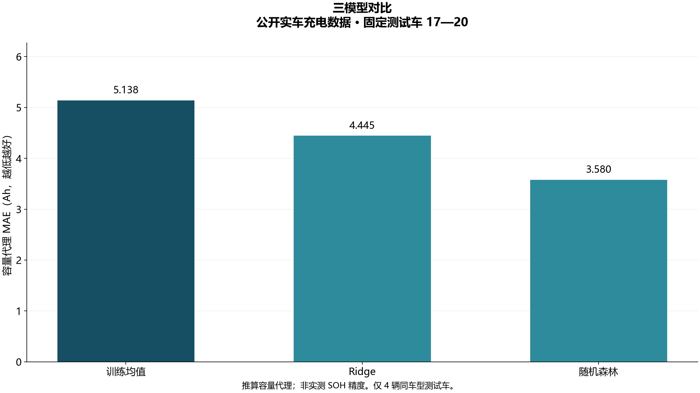
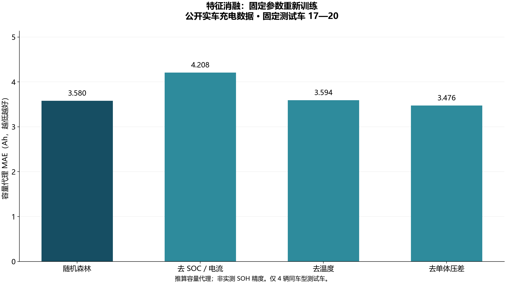
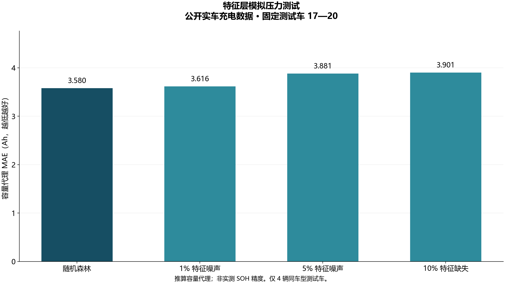
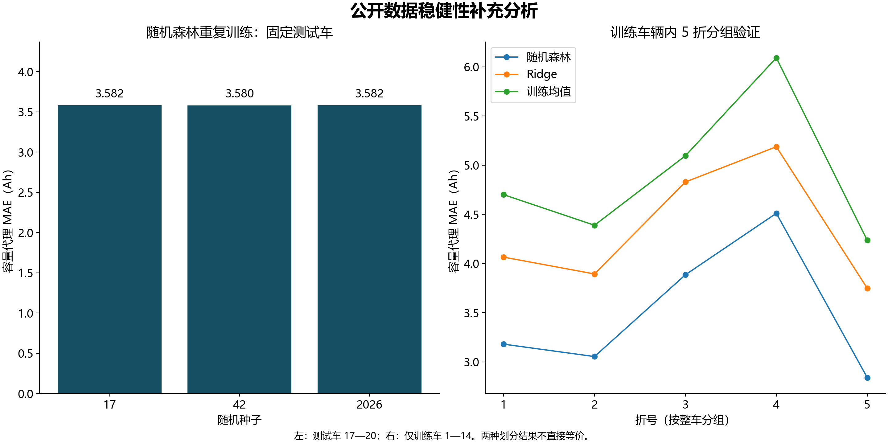

# 电循智策：挑战杯研究证据补充报告

实验分支：experiment/design-data-v2。日期：2026-09-18。

## 一、结论与进展

已有公开实车数据上的模型训练、基线对比和量化结果，本轮补齐重复训练、特征消融、分组验证、输入压力测试和车辆级不确定性分析。它们是**容量代理预测的探索性研究证据**，不能替代独立实测容量、真实 SOH/RUL 或退役安全验证，也不等于已经满足某届挑战杯的全部申报条件。

| 截图中的缺口 | 本轮可核查状态 | 仍需完成 |
| --- | --- | --- |
| 模型训练尚未形成结果 | 三模型重训完成；保存主模型及重载预测一致性检查 | 独立实测容量标签校准 |
| 对比实验尚未完成 | 均值、Ridge、随机森林；三组特征消融 | 外部数据集与论文方法同条件复现 |
| 稳健性验证尚未完成 | 三随机种子、训练车 5 折分组验证、三种输入压力测试 | 跨车型、真实传感器误差、前瞻性验证 |
| 暂无可信量化结果 | 保存逐记录预测、总体/逐车指标、探索性车辆重采样区间 | 更大独立测试车队及可靠置信区间 |

## 二、数据与方法

数据来自公开的 20 辆商用车充电记录。继承的特征缓存包含 29,697 个有效会话；训练 20,851、验证 2,864、测试 5,982。整车固定划分为 1—14 / 15—16 / 17—20。输入为每段前 600 秒的 SOC、电流、电压、温度、单体压差摘要；标签为全段电流积分除以 SOC 增量得到的 Ah 容量代理。

本轮基于已有缓存重新训练，没有重新提取原始全部记录。缓存 SHA-256：
`ebb1f63ca48fe5ac078d0e572c1569693b7352d1c3eec340d37a5a1976b5261e`。

本轮是**已知原测试结果后的补充分析**；先固定 V2_PROTOCOL.md，再运行，不以测试结果调参，不宣称预注册盲测。模型参数沿用原方案：Ridge alpha=10；随机森林 200 棵树、叶节点最少 5 样本。标准化仅拟合训练数据。分组交叉验证只使用训练车。

## 三、固定测试集对比

| 模型 | MAE / Ah | RMSE / Ah | R² | 车辆等权 MAE / Ah |
| --- | --- | --- | --- | --- |
| train_mean | 5.1381 | 6.4347 | -0.0285 | 5.1249 |
| ridge | 4.4449 | 5.7097 | 0.1902 | 4.4363 |
| random_forest | 3.5796 | 4.8489 | 0.4160 | 3.5636 |

随机森林相对训练均值基线的**会话加权 MAE 降低 30.33%**。R² 不是准确率；该改善针对容量代理，一部分预测能力可能来自输入与标签共享电流/SOC 信息。

## 四、稳健性与消融

### 随机种子重复

| 随机种子 | MAE / Ah | RMSE / Ah | R² |
| --- | --- | --- | --- |
| 42 | 3.5796 | 4.8489 | 0.4160 |
| 17 | 3.5821 | 4.8437 | 0.4172 |
| 2026 | 3.5823 | 4.8544 | 0.4146 |

三次测试 MAE 范围 3.5796—3.5823 Ah，只说明固定划分下对这些种子的敏感性，不能替代独立重复采样。

### 特征消融

| 实验 | MAE / Ah | RMSE / Ah | R² |
| --- | --- | --- | --- |
| random_forest | 3.5796 | 4.8489 | 0.4160 |
| without_soc_current | 4.2080 | 5.4688 | 0.2571 |
| without_temperature | 3.5942 | 4.7986 | 0.4280 |
| without_cell_gap | 3.4758 | 4.7336 | 0.4434 |

分别删除 SOC/电流、温度、单体压差组后重新训练。去掉单体压差后，测试 MAE 为 3.4758 Ah，低于完整特征模型；因此不能宣称所有特征均有增益。该现象保留为后续独立数据验证的问题，不据此改选本轮主模型。消融结果描述当前模型与样本中的依赖，不能作因果解释；电压等剩余信号也可能间接编码 SOC 或充电阶段。

### 输入压力

| 实验 | MAE / Ah | RMSE / Ah | R² |
| --- | --- | --- | --- |
| random_forest | 3.5796 | 4.8489 | 0.4160 |
| noise_1pct | 3.6157 | 4.8933 | 0.4052 |
| noise_5pct | 3.8807 | 5.2022 | 0.3278 |
| missing_10pct | 3.9007 | 5.1886 | 0.3313 |

噪声是独立高斯特征扰动，标准差取各特征训练标准差的 1% / 5%；缺失为随机遮蔽 10% 特征元素、使用训练中位数填补。固定模型与标签，只改变评估输入，seed=2026。这不是原始采样点丢包实验，也没有依据真实仪器规格校准噪声；部分扰动组合可能偏离物理一致性。

### 训练车内分组验证

| 模型 | 5 折 MAE 均值 / Ah | 最低折 / Ah | 最高折 / Ah |
| --- | --- | --- | --- |
| random_forest | 3.4938 | 2.8400 | 4.5102 |
| ridge | 4.3446 | 3.7485 | 5.1871 |
| train_mean | 4.9021 | 4.2354 | 6.0912 |

这里均值对折等权，不是全会话加权均值。每折训练/留出车辆清单见 folds.json；参数固定，不利用这些折挑参数，也不把交叉验证得分与原测试集得分当成同一批样本的结果。

## 五、车辆级不确定性

| 模型 | 车辆等权 MAE / Ah | 探索性区间下限 | 上限 | 相对均值基线的配对改善 / Ah |
| --- | --- | --- | --- | --- |
| train_mean | 5.1249 | 4.7182 | 5.5976 | 0.0000 |
| ridge | 4.4363 | 4.1119 | 4.8458 | 0.6886 |
| random_forest | 3.5636 | 3.0554 | 4.0718 | 1.5613 |

每次整车重采样 4 辆、有放回，2000 次，seed=2026，取百分位 2.5% 和 97.5%。先计算逐车误差再等权平均，避免把同车连续会话当独立车辆。配对改善使用同一批车辆，详见 cluster_intervals.json。只有 4 辆测试车，区间支持度有限，不作统计显著性或跨车型性能承诺；不是单个预测的预测区间。

## 六、申报书可粘贴文字

### 作品撰写的目的和基本思路

本作品围绕新能源汽车电池运行数据的质量治理与状态评估开展研究，探索从充电片段识别、特征提取到容量代理预测及结果解释的可复现分析流程。研究采用公开实车充电数据，按车辆实体划分训练、验证和测试集，以训练均值、线性回归及随机森林进行比较，并通过特征消融、分组验证和输入压力测试考察方法的适用边界。原型系统用于展示数据检查与辅助分析流程；真实健康状态、剩余寿命及循环利用路径的有效性仍需独立实测标签和应用场景验证。

### 作品的科学性、先进性及独特之处

本作品注重车辆实体隔离、训练过程可复现和结论可追溯，避免同车数据随机拆分造成的评估偏差。当前已在 20 辆公开车辆的 29,697 个充电片段上完成三类基线比较，并补充特征消融、不同随机种子重复实验、训练车辆内分组交叉验证及特征层压力测试。固定测试集上随机森林的容量代理预测 MAE 为 3.5796 Ah、RMSE 为 4.8489 Ah、R² 为 0.4160；相对训练均值基线的 MAE 降低 30.33%。上述结果说明方法在本数据源上具有代理量预测能力，不代表真实 SOH 测量精度；尚未证明相对已有文献方法的领先性。

### 作品的实际应用价值和现实意义

本作品形成了可追溯的数据质量检查、模型比较和误差分析流程，可作为后续电池评估研究与原型开发的基础，并帮助识别数据不足时不宜输出确定性结论的场景。预期应用包括检测数据预处理、健康评估研究辅助及循环利用方案展示。现阶段尚未完成企业部署或真实退役效果验证，不能宣称已降低检测成本、事故率或碳排放；相关价值需在独立实测容量校准和场景试验中量化。

### 学术论文文摘草稿

针对实车充电数据中标签获取困难及同车样本相关性问题，本研究构建按车辆隔离的容量代理预测实验流程，使用 20 辆公开车辆的充电记录提取 29,697 个有效片段，以片段前 600 秒的多维摘要预测由全段电流积分和 SOC 变化推算的容量代理。比较训练均值、Ridge 与随机森林，并实施特征消融、随机种子重复、分组验证和输入压力测试。固定测试车辆上，随机森林 MAE 为 3.5796 Ah，RMSE 为 4.8489 Ah。结果表明该流程具有本数据源内的代理预测能力，但输入与代理标签共享电学信号、独立测试车辆较少，尚需实测容量与跨车型数据进一步验证。

## 七、尚不能写成已完成的事项

- 真实 SOH/RUL 精度、故障诊断敏感度、退役决策安全性、碳减排实效。
- 外部实验室容量校准、跨车型泛化、企业合作与部署成效、论文发表或专利授权。
- 本报告不替代正式参赛通知、资格审核和完整论文。引用会话中的旧校赛条件未在本轮取得原始文件核验。

## 八、复现与证据目录

依赖与命令见上一级 V2_README.md。metrics.csv 为全部实验结果；predictions.csv.gz 为逐会话预测；per_vehicle.csv 为逐车误差；group_cv.csv 与 folds.json 为分组证据；manifest.json 为环境、输入与源码摘要。训练模型另行保存在交付包 models/，不加载来历不明的 joblib。

## 九、来源与参考

1. Deng Z, Xu L, Liu H, Hu X, Duan Z, Xu Y. Prognostics of battery capacity based on charging data and data-driven methods for on-road vehicles. Applied Energy, 2023, 339:120954. https://doi.org/10.1016/j.apenergy.2023.120954
2. [数据作者仓库](https://github.com/BatICM/battery-charging-data-of-on-road-electric-vehicles)。本项目原下载版本与摘要见上一级 README.md 及 results/ev/raw_manifest.json。
3. [scikit-learn 分组交叉验证文档](https://scikit-learn.org/stable/modules/cross_validation.html)。本轮使用 GroupKFold，实际依赖版本以 requirements-v2.lock 为准。

以上为本研究引用来源，不等同完成系统文献检索或查新。
